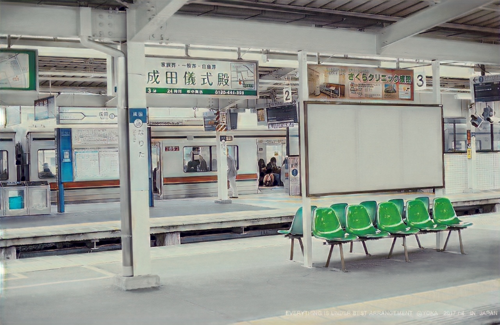
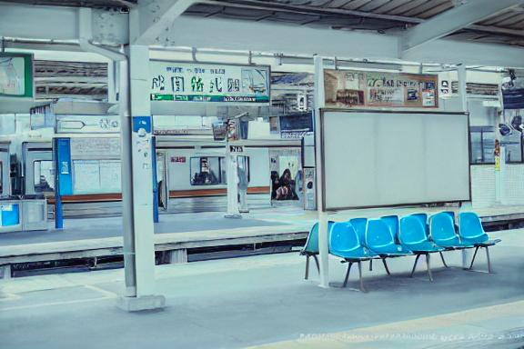

# Conditional GAN + Stable-Diffusion To Create Anime-Styled Images And Make Custom Animation Edits

## WORK INSPIRED FROM FOLLOWING PAPERS

```
1. AnimeGAN: A Novel Lightweight GAN for Photo Animation
2. InstructPix2Pix: Learning to Follow Image Editing Instructions
```

----------------------
## 1.SUMMARY

Training and Inference code for a model to convert input images into anime_style
Inference code to use Stable-Diffusion model to edit the anime_style image generated

-----------------------
## 2. DATA AND CHECKPOINTS

### 2.1 DOWNLOAD DATASET FOR TRAINING CGAN

```bash
wget -O anime-gan.zip https://github.com/ptran1203/pytorch-animeGAN/releases/download/v1.0/dataset_v1.zip
unzip anime-gan.zip -d /content
```

### 2.2 DOWNLOAD STABLE DIFFUSION CHECKPOINTS
```
bash scripts/download_checkpoints.sh
```

-----------------------
## 2. VSCODE DEBUGGER CONFIGS TO RUN TRAIN AND INFERENCE SCRIPTS

### 2.1 Train CGAN for converting images into anime style
{
    "name": "train",
    "type": "python",
    "request": "launch",
    "program": "${workspaceFolder}/train.py",
    "console": "integratedTerminal",
    "justMyCode": true,
    "args": [
        "--dataset", "Hayao",
        "--batch", "6",
        "--init-epochs", "4",
        "--checkpoint-dir", "checkpoints",
        "--save-image-dir", "save_imgs",
        "--save-interval", "1",
        "--gan-loss", "lsgan",
        "--init-lr", "0.0001",
        "--lr-g", "0.00002",
        "--lr-d", "0.00004",
        "--wadvd", "10.0",            
        "--wadvg", "10.0",              
        "--wcon", "1.5",              
        "--wgra", "3.0",                
        "--wcol", "30.0",                
        "--resume", "GD",               
        "--use_sn"
    ]
}

### 2.2 Inference With CGAN
{
    "name": "animegan_inference",
    "type": "python",
    "request": "launch",
    "program": "${workspaceFolder}/inference_image.py",
    "console": "integratedTerminal",
    "justMyCode": true,
    "args": [
        "--checkpoint", "checkpoints/generator_Hayao.pth",
        "--src", "example/10.jpg",
        "--dest", "save_imgs/inference_images/10_anime.jpg",
    ]
}

### 2.3 Edit Anime Styled Image With Stable-Diffusion
{
    "name": "edit_cli",
    "type": "python",
    "request": "launch",
    "program": "${workspaceFolder}/edit_cli.py",
    "console": "integratedTerminal",
    "justMyCode": true,
    "args": [
        "--input", "save_imgs/inference_images/10_anime.jpg",
        "--output", "save_imgs/inference_images/10_anime_stable_diffused.jpg",
        "--edit", "turn green chairs into blue"
    ]
}

-----------------------
## 3. RESULTS

### 3.1 INPUT IMAGE


### 3.2 ANIME STYLED IMAGE GENERATED


### 3.3 STABLE DIFFUSION EDITED IMAGE


-----------------------
